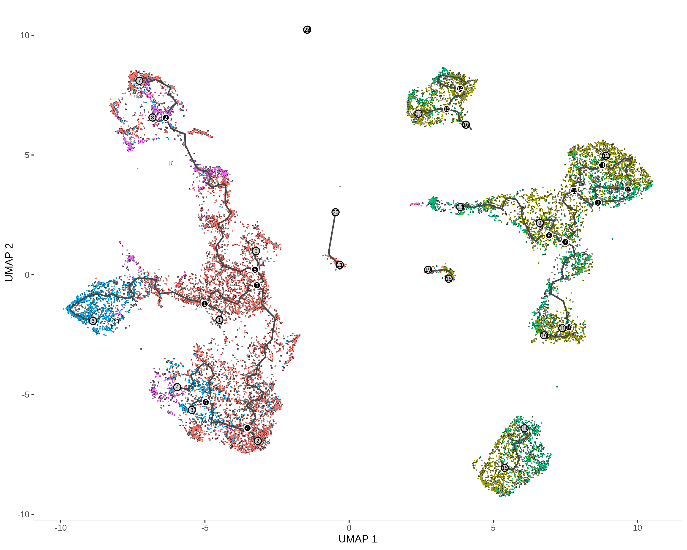

# Axolotl Limb Regeneration scRNA-seq Analysis

## Project Overview

This project investigates transcriptional dynamics during axolotl limb regeneration using single-cell RNA-seq data. The analysis focuses on identifying major cell populations and characterizing fibroblast-associated trajectory changes across regeneration timepoints.

---

## Highlights

- 22 cell populations identified from integrated scRNA-seq dataset 
- Fibroblast trajectory reconstructed using Monocle3 pseudotime 
- Dynamic genes driving regeneration identified using graph_test() 
 
---

## Objective

The goal of this project is to:

- Re-cluster and annotate cell populations from an integrated scRNA-seq dataset
- Identify biologically meaningful cell types
- Focus on fibroblast populations relevant to blastema formation
- Perform trajectory analysis to study cellular progression
- Identify genes dynamically regulated during regeneration

---

## Dataset

The analysis starts from a post-QC, integrated Seurat object:

all_integrated.rds

Due to file size limitations, the dataset is not included in this repository.

The dataset is derived from previously published axolotl limb regeneration single-cell RNA-seq studies.

**Data Source:**
- Li et al., 2021 – Single-cell analysis of axolotl limb regeneration
- Integrated dataset provided in processed Seurat format

Users should place the dataset in:

data/all_integrated.rds

or reconstruct it from the original raw data using the published pipeline.
---

## Methods

### Clustering (Seurat v5)
- PCA performed with 50 components
- 20 principal components selected
- Clustering resolution = 0.6
- UMAP visualization

### Annotation
- Manual annotation based on marker genes
- 22 clusters identified and biologically classified

### Trajectory Analysis (Monocle3)
- Fibroblast populations used:
  - Fibroblast_ECM_rich
  - Activated_Fibroblast
- Root cells selected from:
  - control
  - 3h timepoints
- Pseudotime ordering performed

### Dynamic Gene Analysis
- Performed using graph_test()
- Genes ranked by q-value
- Top pseudotime genes identified

---

## Key Results

- Identified 22 distinct cell populations
- Characterized fibroblast-driven regeneration trajectory
- Captured pseudotime progression from early to late stages
- Identified dynamic genes associated with regeneration

---

## Key Visualizations

### UMAP Clustering

### Annotated Cell Types

### Fibroblast Trajectory

### Pseudotime Progression

### Top Dynamic Genes

---

## Repository Structure

scripts/        Analysis scripts
results/        Figures and tables 
data/           Data instruction 
docs/           Supporting notes
environment/    Reproducibility info 

---

## How to Reproduce

### 1. Data setup

Place the input Seurat object in:

data/all_integrated.rds

If the file is not available, users may reconstruct it from the original dataset described above.

### 2. Run analysis pipeline

Rscript scripts/01_clustering_seurat.R
Rscript scripts/02_annotation.R
Rscript scripts/03_trajectory_monocle3.R 
Rscript scripts/04_dynamic_genes.R

---

## Tools Used

- R
- Seurat v5
- Monocle3
- ggplot2

---

## Author

Suhani Patel
MS Bioinformatics
Northeastern University
